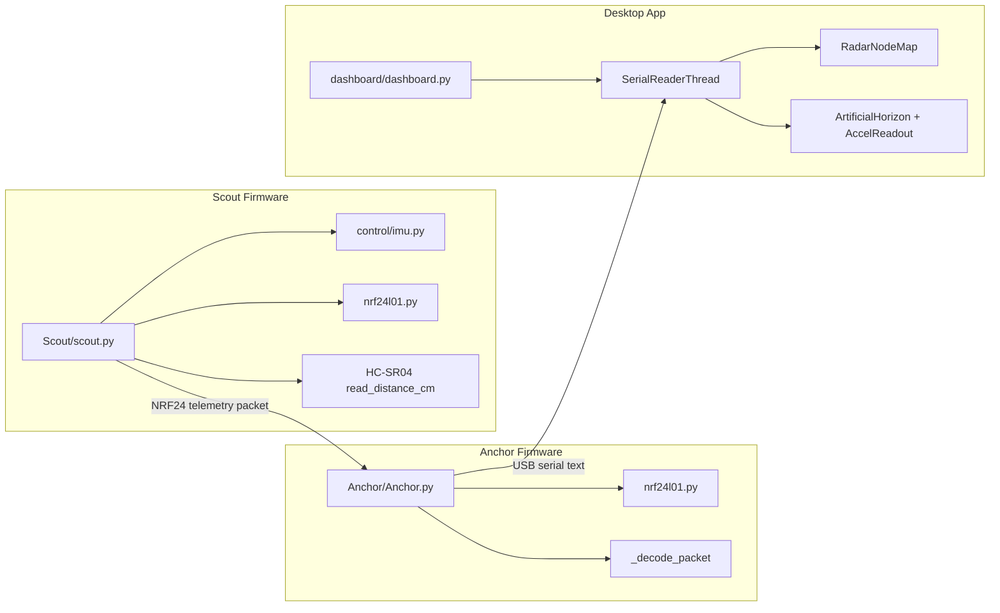

# SearchNRescue

SearchNRescue is a two-node Pico robot telemetry project with a desktop dashboard.

- Scout node collects distance and IMU data, then transmits telemetry via nRF24L01.
- Anchor node receives telemetry over nRF24L01 and prints parsed lines over USB serial.
- Dashboard (PyQt6) reads serial telemetry, shows radar/attitude widgets, and can launch Anchor through mpremote.

## Project Layout

- `Scout/scout.py` — Scout transmitter firmware (HC-SR04 + BMI160 + nRF24L01)
- `Anchor/Anchor.py` — Anchor receiver firmware (nRF24L01 + USB serial output)
- `dashboard/dashboard.py` — Desktop telemetry dashboard (Windows/Linux/macOS)
- `control/` — Sensor and actuator helpers for MicroPython side
- `Test/` — Hardware self-test scripts
- `nrf24l01.py` — MicroPython nRF24L01 driver

## Quick Start

1. Follow setup steps in SETUP.md.
2. Flash and run Scout and Anchor firmware on two Pico boards.
3. Start desktop dashboard:

```powershell
py -3 dashboard/dashboard.py
```

4. In dashboard:
   - Select serial port for Anchor board (for example COM4)
   - Click CONNECT

## Data Flow

1. Scout reads HC-SR04 distance and BMI160 gyro.
2. Scout packs telemetry into NRF payload and transmits.
3. Anchor receives payload, decodes fields, prints readable telemetry lines.
4. Dashboard parses Anchor serial output and updates radar + attitude widgets.

## Code Architecture Diagram





## Hardware Pinout Diagram

```mermaid
flowchart TB
   subgraph ScoutPico[Scout Pico]
      SGP18[GP18 SCK]
      SGP19[GP19 MOSI]
      SGP16[GP16 MISO]
      SGP14[GP14 CSN]
      SGP17[GP17 CE]
      SGP6[GP6 TRIG]
      SGP7[GP7 ECHO]
      SGP4[GP4 I2C SDA]
      SGP5[GP5 I2C SCL]
   end

   subgraph AnchorPico[Anchor Pico]
      AGP18[GP18 SCK]
      AGP19[GP19 MOSI]
      AGP16[GP16 MISO]
      AGP14[GP14 CSN]
      AGP17[GP17 CE]
      AUSB[USB serial to PC]
   end

   subgraph NRFScout[nRF24L01 Scout]
      NSCK[SCK]
      NMOSI[MOSI]
      NMISO[MISO]
      NCSN[CSN]
      NCE[CE]
      NVCC[3.3V]
      NGND[GND]
   end

   subgraph NRFAnchor[nRF24L01 Anchor]
      ASCK[SCK]
      AMOSI[MOSI]
      AMISO[MISO]
      ACSN[CSN]
      ACE[CE]
      AVCC[3.3V]
      AGND[GND]
   end

   subgraph HCSR04[HC-SR04]
      HTRIG[TRIG]
      HECHO[ECHO]
   end

   subgraph BMI160[BMI160]
      BI2CSDA[SDA]
      BI2CSCL[SCL]
   end

   SGP18 --> NSCK
   SGP19 --> NMOSI
   SGP16 --> NMISO
   SGP14 --> NCSN
   SGP17 --> NCE

   AGP18 --> ASCK
   AGP19 --> AMOSI
   AGP16 --> AMISO
   AGP14 --> ACSN
   AGP17 --> ACE

   SGP6 --> HTRIG
   SGP7 --> HECHO
   SGP4 --> BI2CSDA
   SGP5 --> BI2CSCL

   AUSB --> PC[Dashboard PC]
```





## Notes

- Current radar range in dashboard is configured to 70 cm max.
- Dashboard expects one process per COM port. If COM port is busy, close REPL/serial monitor tools first.
- If `mpremote` is not found in PATH, dashboard falls back to `python -m mpremote`.

## Common Commands

Run dashboard with explicit venv interpreter:

```powershell
c:/Users/berke/SearchNRescue/.venv/Scripts/python.exe dashboard/dashboard.py
```

Quick syntax check for dashboard:

```powershell
c:/Users/berke/SearchNRescue/.venv/Scripts/python.exe -m py_compile dashboard/dashboard.py
```

## License

MIT
